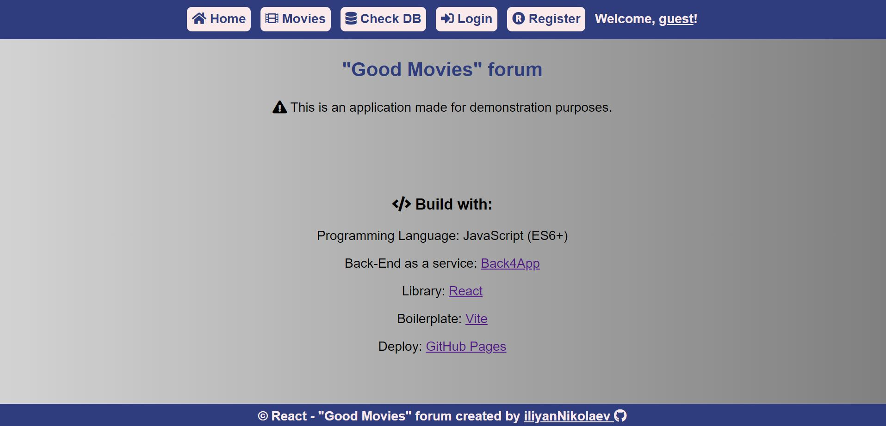

# "Good Movies" forum
* Author - Iliyan Nikolaev M.
* Release date - Q3'23
* Live Demo: [view demo](https://iliyannikolaev.github.io/movies-react-app/)
* You can log in with: username: "test" / password: "123456"
* Commit history is here: [view commit history](https://github.com/iliyanNikolaev/SoftUni-ReactJS/commits/main/vite-demo/vite-project)

## Contents
1. [Introduction](#introduction)
2. [Used Technologies](#usedTech)
3. [Rest API Details](#restApi)
4. [Screenshots](#screenshots)


### Introduction

This is a forum where users can add movies for discussion and communicate with other users through comments.
Users can register and log in, create, edit, and delete movies and comments.

### <a name="usedTech"></a> Used Technologies

* Programming Language - JavaScript (ES6+)
* Library - [React](https://react.dev/)
* Backend as a Service - BaaS - [Back4App](https://www.back4app.com/)
* Style - CSS
* Boilerplate - [Vite](https://vitejs.dev/)
* Deploy - [GitHub Pages](https://pages.github.com/)

### <a name="restApi"></a> Rest Api Details


There are 3 entities in the database: **Users**, **Movies**, and **Comments**.

Here are the schemas for each of the entities:

* **Movies**

```json
{
  "title": "A string",
  "description": "A string",
  "imgURL": "A string",
  "owner": { "__type": "Pointer", "className": "_User", "objectId": "<THE_REFERENCED_OBJECT_ID>" }
}
```
* **Comments**

```json
{
  "content": "A string",
  "movieId": "A string",
  "owner": { "__type": "Pointer", "className": "_User", "objectId": "<THE_REFERENCED_OBJECT_ID>" },
  "username": "A string"
}
```

* **Users**

```json
{
  "objectId": "4BwpMWdCnm",
  "username": "A string",
  "email": "A string",
  "password": "#Password123",
  "createdAt": "2018-11-06T00:52:01.520Z",
  "updatedAt": "2018-11-06T00:52:04.713Z"
}
```

The "**owner**" property of **Movies** and **Comments** is a relation to the **Users** entity, pointing to the user who created the respective entry. This helps with security rules, specifically determining what kind of requests different types of users can send to the server.

There are two types of users: **ADMIN** and **USER**.


Certainly, here's a table representation of the different user permissions:

|Type User   |Movies READ|Movies CREATE|Movies EDIT|Movies DELETE|Comments READ|Comments CREATE|Comments EDIT|Comments DELETE|
|:----------:|:---------:|:-----------:|:---------:|:-----------:|:-----------:|:-------------:|:-----------:|:-------------:|
|UNAUTHORIZED|&#10004;   |&#10060;     |&#10060;   |&#10060;     |&#10004;     |&#10060;       |&#10060;     |&#10060;       |
|AUTHORIZED  |&#10004;   |&#10004;     |&#10060;   |&#10060;     |&#10004;     |&#10004;       |&#10060;     |&#10060;       |
|owner       |&#10004;   |-            |&#10004;   |&#10004;     |&#10004;     |-              |&#10004;     |&#10004;       |
|ADMIN       |&#10004;   |&#10004;     |&#10060;   |&#10004;     |&#10004;     |&#10004;       |&#10060;     |&#10004;       |

### Screenshots



